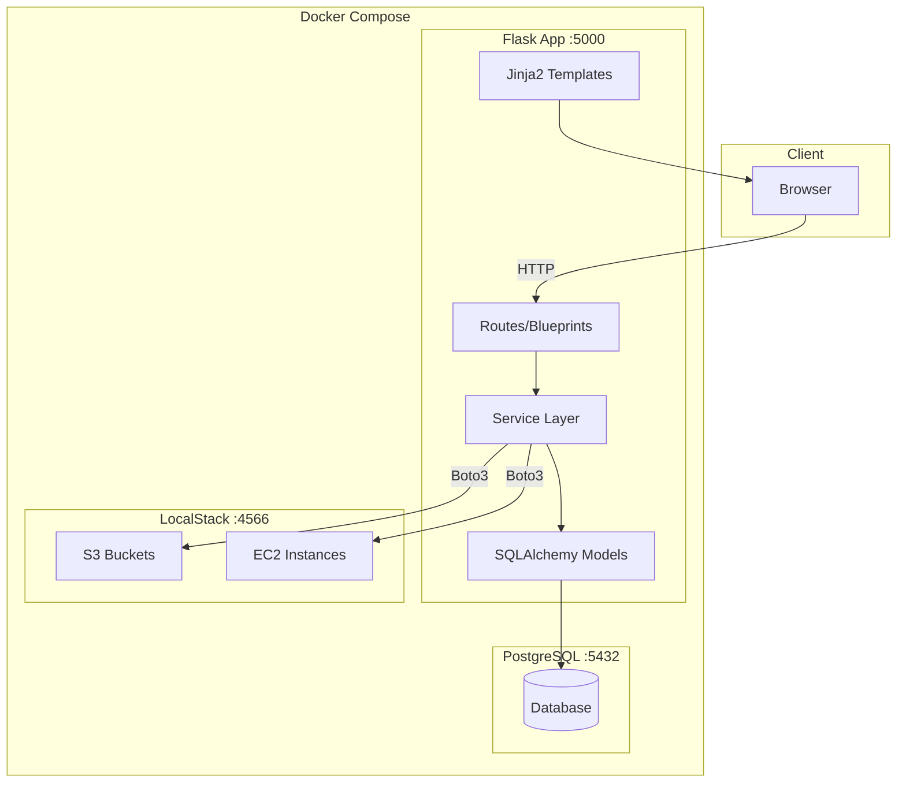
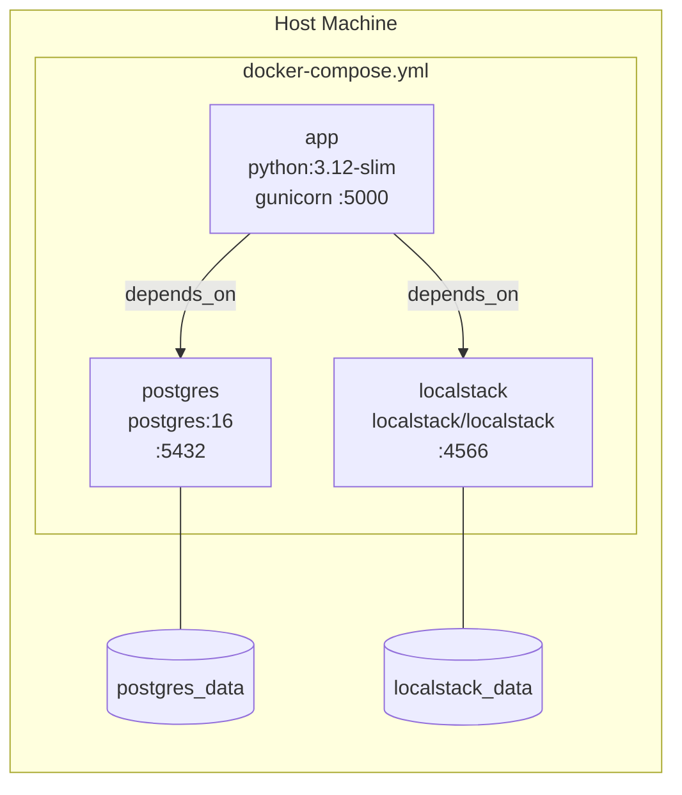
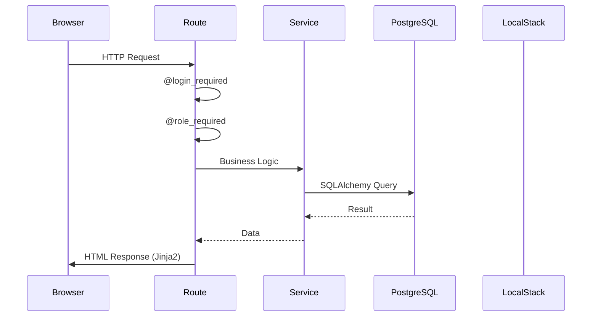
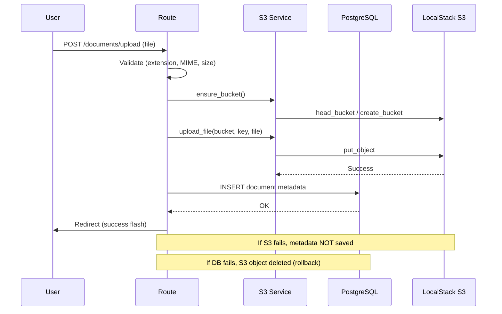
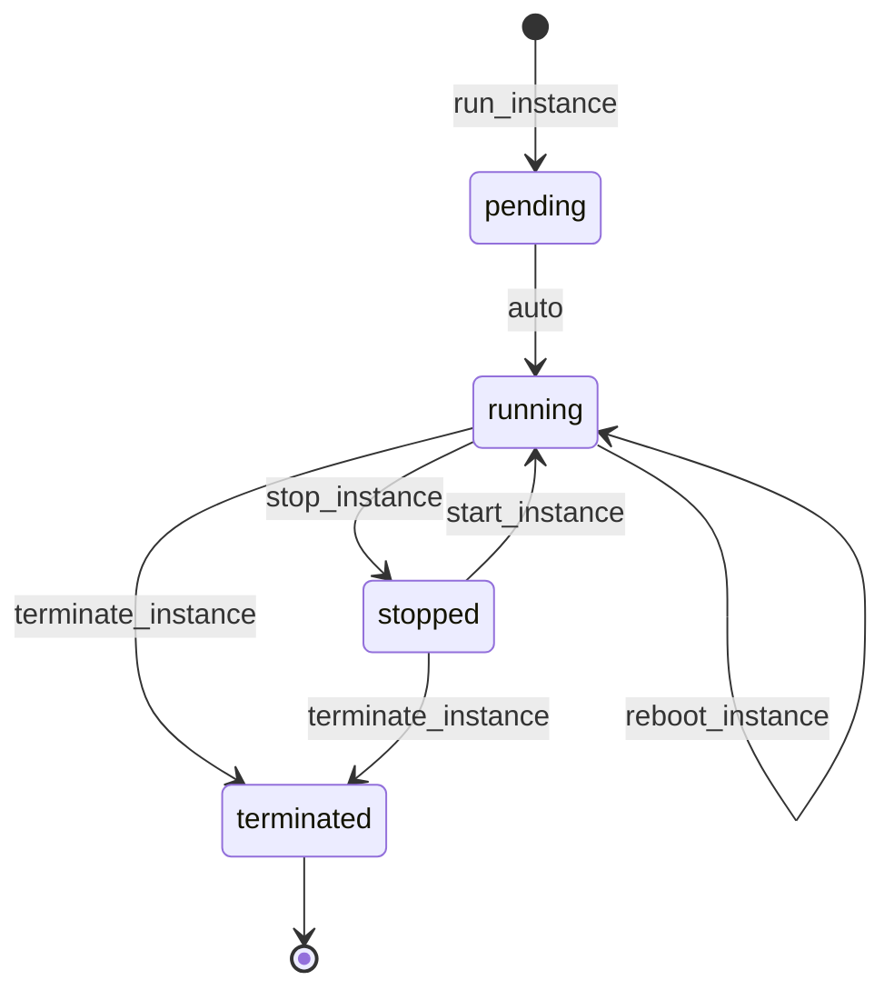
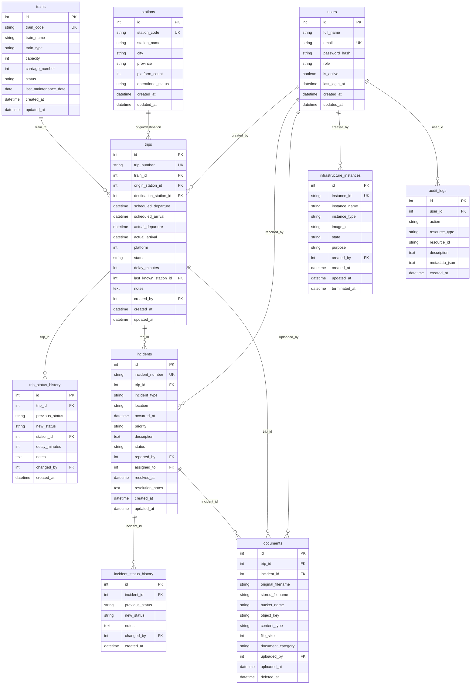

# Architecture — RailOps Nusantara

## Component Diagram

```mermaid
graph TB
    subgraph Client
        Browser[Browser]
    end

    subgraph Docker["Docker Compose"]
        subgraph App["Flask App :5000"]
            Routes[Routes/Blueprints]
            Services[Service Layer]
            Models[SQLAlchemy Models]
            Templates[Jinja2 Templates]
        end

        subgraph PG["PostgreSQL :5432"]
            DB[(Database)]
        end

        subgraph LS["LocalStack :4566"]
            S3[S3 Buckets]
            EC2[EC2 Instances]
        end
    end

    Browser -->|HTTP| Routes
    Routes --> Services
    Services --> Models
    Models --> DB
    Services -->|Boto3| S3
    Services -->|Boto3| EC2
    Templates --> Browser
```

## Container/Deployment Diagram

```mermaid
graph LR
    subgraph Host["Host Machine"]
        subgraph DC["docker-compose.yml"]
            APP["app<br/>python:3.12-slim<br/>gunicorn :5000"]
            PG["postgres<br/>postgres:16<br/>:5432"]
            LS["localstack<br/>localstack/localstack<br/>:4566"]
        end
        VOL1[("postgres_data")]
        VOL2[("localstack_data")]
    end

    APP -->|depends_on| PG
    APP -->|depends_on| LS
    PG --- VOL1
    LS --- VOL2
```

## Request Flow

```mermaid
sequenceDiagram
    participant B as Browser
    participant R as Route
    participant S as Service
    participant DB as PostgreSQL
    participant LS as LocalStack

    B->>R: HTTP Request
    R->>R: @login_required
    R->>R: @role_required
    R->>S: Business Logic
    S->>DB: SQLAlchemy Query
    DB-->>S: Result
    S-->>R: Data
    R->>B: HTML Response (Jinja2)
```

## S3 Upload Flow

```mermaid
sequenceDiagram
    participant U as User
    participant R as Route
    participant S as S3 Service
    participant DB as PostgreSQL
    participant LS as LocalStack S3

    U->>R: POST /documents/upload (file)
    R->>R: Validate (extension, MIME, size)
    R->>S: ensure_bucket()
    S->>LS: head_bucket / create_bucket
    R->>S: upload_file(bucket, key, file)
    S->>LS: put_object
    LS-->>S: Success
    R->>DB: INSERT document metadata
    DB-->>R: OK
    R->>U: Redirect (success flash)

    Note over R,LS: If S3 fails, metadata NOT saved
    Note over R,DB: If DB fails, S3 object deleted (rollback)
```

## EC2 Lifecycle Flow

```mermaid
stateDiagram-v2
    [*] --> pending: run_instance
    pending --> running: auto
    running --> stopped: stop_instance
    running --> terminated: terminate_instance
    stopped --> running: start_instance
    stopped --> terminated: terminate_instance
    running --> running: reboot_instance
    terminated --> [*]
```

## Database ER Diagram

```mermaid
erDiagram
    users {
        int id PK
        string full_name
        string email UK
        string password_hash
        string role
        boolean is_active
        datetime last_login_at
        datetime created_at
        datetime updated_at
    }

    trains {
        int id PK
        string train_code UK
        string train_name
        string train_type
        int capacity
        int carriage_number
        string status
        date last_maintenance_date
        datetime created_at
        datetime updated_at
    }

    stations {
        int id PK
        string station_code UK
        string station_name
        string city
        string province
        int platform_count
        string operational_status
        datetime created_at
        datetime updated_at
    }

    trips {
        int id PK
        string trip_number UK
        int train_id FK
        int origin_station_id FK
        int destination_station_id FK
        datetime scheduled_departure
        datetime scheduled_arrival
        datetime actual_departure
        datetime actual_arrival
        int platform
        string status
        int delay_minutes
        int last_known_station_id FK
        text notes
        int created_by FK
        datetime created_at
        datetime updated_at
    }

    trip_status_history {
        int id PK
        int trip_id FK
        string previous_status
        string new_status
        int station_id FK
        int delay_minutes
        text notes
        int changed_by FK
        datetime created_at
    }

    incidents {
        int id PK
        string incident_number UK
        int trip_id FK
        string incident_type
        string location
        datetime occurred_at
        string priority
        text description
        string status
        int reported_by FK
        int assigned_to FK
        datetime resolved_at
        text resolution_notes
        datetime created_at
        datetime updated_at
    }

    incident_status_history {
        int id PK
        int incident_id FK
        string previous_status
        string new_status
        text notes
        int changed_by FK
        datetime created_at
    }

    documents {
        int id PK
        int trip_id FK
        int incident_id FK
        string original_filename
        string stored_filename
        string bucket_name
        string object_key
        string content_type
        int file_size
        string document_category
        int uploaded_by FK
        datetime uploaded_at
        datetime deleted_at
    }

    infrastructure_instances {
        int id PK
        string instance_id UK
        string instance_name
        string instance_type
        string image_id
        string state
        string purpose
        int created_by FK
        datetime created_at
        datetime updated_at
        datetime terminated_at
    }

    audit_logs {
        int id PK
        int user_id FK
        string action
        string resource_type
        string resource_id
        text description
        text metadata_json
        datetime created_at
    }

    users ||--o{ trips : "created_by"
    trains ||--o{ trips : "train_id"
    stations ||--o{ trips : "origin/destination"
    trips ||--o{ trip_status_history : "trip_id"
    trips ||--o{ incidents : "trip_id"
    trips ||--o{ documents : "trip_id"
    incidents ||--o{ incident_status_history : "incident_id"
    incidents ||--o{ documents : "incident_id"
    users ||--o{ incidents : "reported_by"
    users ||--o{ documents : "uploaded_by"
    users ||--o{ infrastructure_instances : "created_by"
    users ||--o{ audit_logs : "user_id"
```
