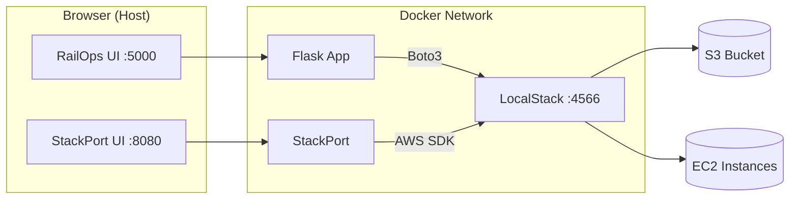

# StackPort Resource Browser — RailOps Nusantara

## Deskripsi

StackPort adalah resource browser open-source untuk melihat dan memeriksa resource AWS yang berjalan pada LocalStack. Pada project ini, StackPort digunakan untuk memonitor S3 buckets/objects dan EC2 instances yang dibuat melalui aplikasi RailOps Nusantara.

**StackPort terhubung ke LocalStack, BUKAN ke AWS asli.**

## Arsitektur



## Konfigurasi

| Parameter | Nilai |
|-----------|-------|
| Image | `davireis/stackport:latest` |
| Port | 8080 |
| AWS_ENDPOINT_URL | `http://localstack:4566` |
| AWS_REGION | `ap-southeast-1` |
| AWS_ACCESS_KEY_ID | `test` |
| AWS_SECRET_ACCESS_KEY | `test` |

## Menjalankan

```bash
docker compose up -d
```

Buka: http://localhost:8080

## Verifikasi S3

1. Buka StackPort di http://localhost:8080
2. Pilih service **S3**
3. Bucket `railops-bucket` harus terlihat
4. Object yang diupload melalui RailOps (/documents/upload) akan tampil

Verifikasi via CLI:
```bash
aws --endpoint-url=http://localhost:4566 s3 ls
aws --endpoint-url=http://localhost:4566 s3 ls s3://railops-bucket --recursive
```

## Verifikasi EC2

1. Buka StackPort di http://localhost:8080
2. Pilih service **EC2**
3. Instance yang dibuat melalui RailOps (/infrastructure/ec2) akan tampil
4. Perubahan state (start/stop/terminate) terlihat setelah refresh

Verifikasi via CLI:
```bash
aws --endpoint-url=http://localhost:4566 --region ap-southeast-1 ec2 describe-instances
```

## Endpoint: Container vs Host

| Dari | Endpoint LocalStack |
|------|-------------------|
| Container (app, stackport) | `http://localstack:4566` |
| Host/Browser | `http://localhost:4566` |

StackPort berjalan sebagai container, sehingga menggunakan `http://localstack:4566`.

## Troubleshooting

| Masalah | Solusi |
|---------|--------|
| StackPort blank/loading | Pastikan LocalStack healthy: `docker compose logs localstack` |
| Bucket tidak tampil | Jalankan: `docker compose exec app python scripts/init_localstack.py` |
| EC2 kosong | Buat instance via RailOps atau: `docker compose exec app python scripts/init_ec2_demo.py` |
| Port 8080 bentrok | Ubah port di docker-compose.yml: `"8081:8080"` |

## Peringatan Keamanan

- Jangan gunakan AWS credential asli
- Jangan arahkan StackPort ke endpoint AWS production
- Credential `test/test` hanya untuk LocalStack development
- StackPort pada project ini HANYA untuk inspeksi resource lokal
